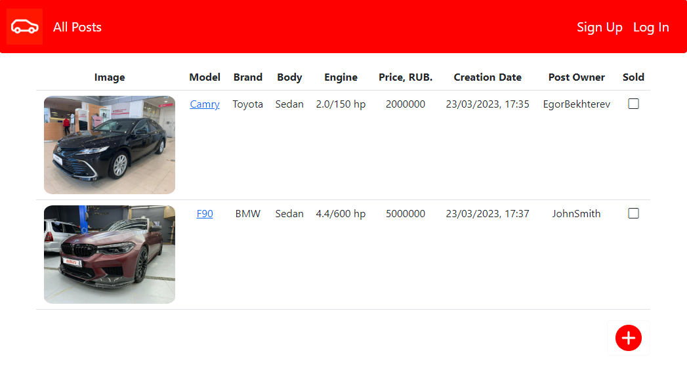
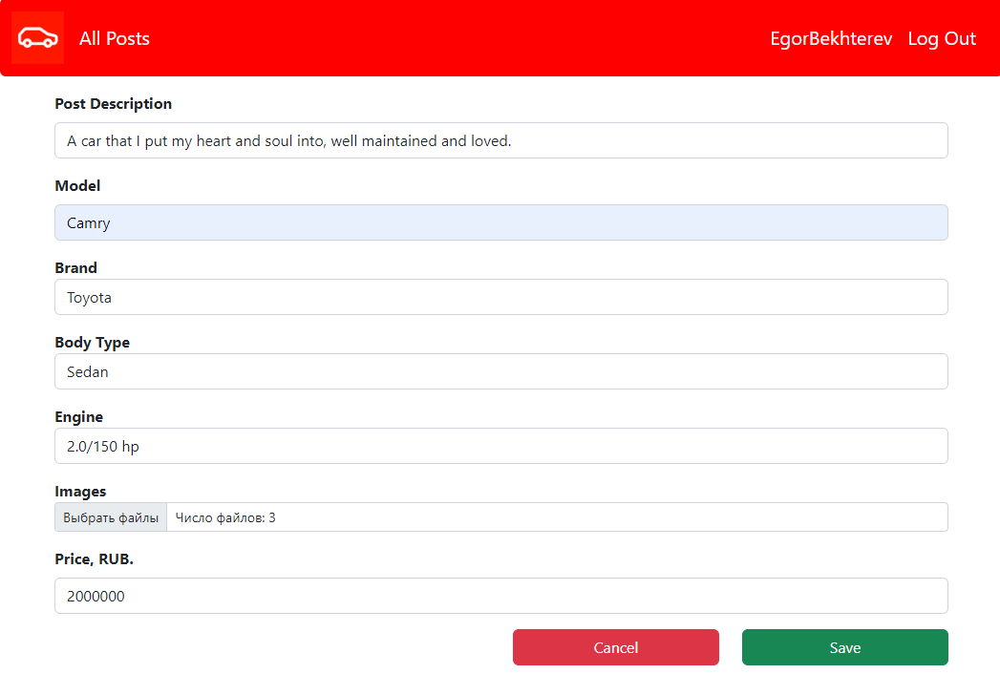
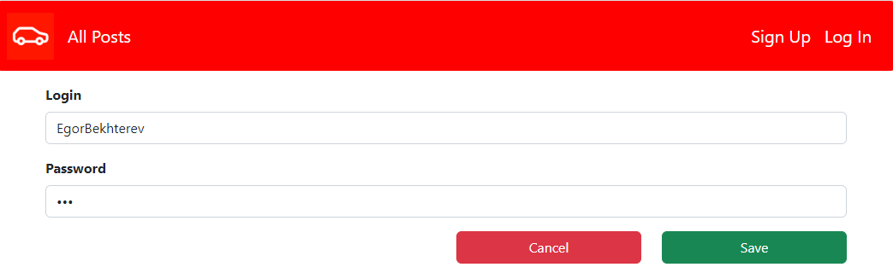
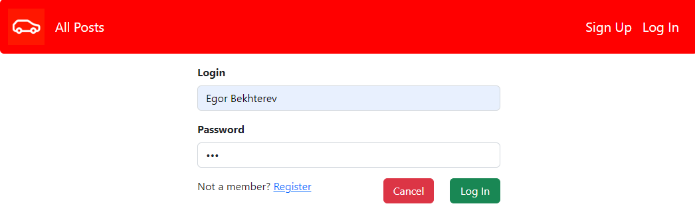
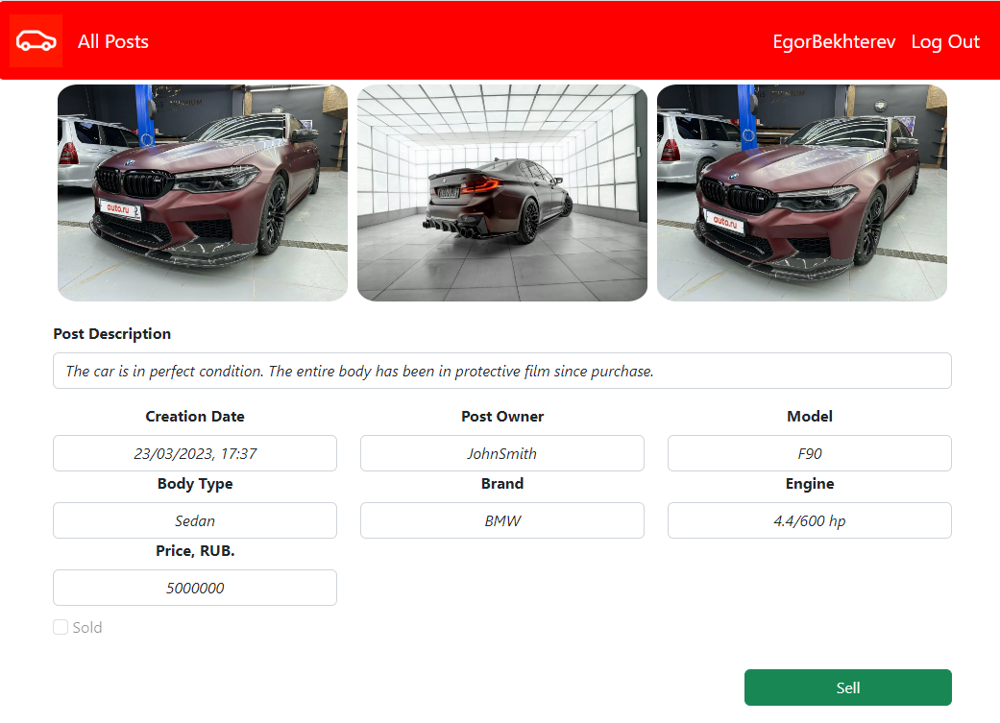
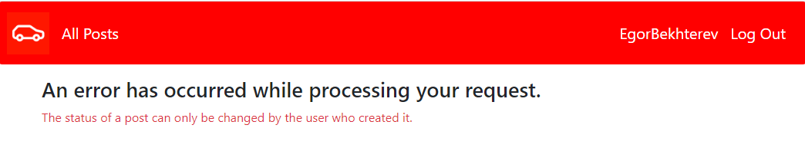

# job4j_cars

## Описание проекта

* Web-приложение, представляющее собой минимальный функционал маркетплейса для автомобилей.
* Основная страница содержит все объявления о продаже машин.
* Можно создать свое объявление, добавить фотографии, выбрать марку, тип кузова, тип двигателя.
* Реализована авторизация и аутентификация пользователей сервиса.

## Стек технологий

- **Java 17.0.2**
- **Spring Boot 2.7.6**
- **Hibernate 5.6.11**
- **Lombok 1.18.22**
- **Thymeleaf**
- **Bootstrap 5.2.3**
- **HTML5**
- **PostgreSQL 15**
- **Liquibase 4.15.0**
- **H2DB 2.1.214**
- **Junit 5.8.2**
- **Mockito 3.5.13**
- **Maven 3.8.1**

## Требования к окружению

- **Java 17.0.2**
- **Maven 3.8.1**
- **PostgresSQL 15**

## Сборка и запуск

- **Создать БД**

``` 
create database cars;
```

- **Запустить проект по команде**

``` 
mvn spring-boot:run -Pproduction
```

- **Перейти в браузере по ссылке**

``` 
http://localhost:8080/
```

## Взаимодействие с приложением

### Основная страница. Отображает все добавленные объявления о продаже автомобилей.


### Страница добавления объявления о продаже автомобиля. Только авторизованный пользователь может добавить объявление. Можно прикрепить сразу несколько фотографий.


### Страница регистрации пользователя.


### Страница аутентификации пользователя.


### Страница выбранного объявления. Владелец объявления может изменить статус объявления нажав на кнопку Sell.


### Если другой пользователь пытается изменить статус чужого объявления, выполняется переход на форму с ошибкой.


## Контакты для связи
telegram: <a href="https://t.me/bekhterev_egor" target="blank">@bekhterev_egor</a>
